Emoji banner
March 2019
https://github.com/danbernier/emoji-banner

Sometimes a prank 
opens up a possibility
to do an old thing in a new way.

At TED, we chatted in [flowdock](https://flowdock.com/) (it's like Slack, but
less popular). 

The team developed a peculiar appreciation for custom emoji, specifically for
how nice they look. I suspect this is because flowdock lets you control
(independent from the text) the size of emoji, and the team had developed a
culture of setting that slider to "very, very large". The ugly parts of a
custom emoji will be very apparent.

When you hover over a message, flowdock changes its background color from white
to gray, so an emoji with a white background will have a white box around it.
Most of the team was able to make the background of an image transparent, but
sometimes, through a lack of skill or a lack of patience, or maybe because they
just didn't think about the hover, someone would upload an emoji with a white
background, and take some heat for it.

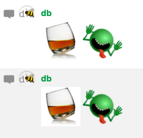

Like a meme or a fever, every few months people would argue about custom emoji
with white backgrounds. In one of these outbreaks, some cheeky emojist made an
invisible animated emoji of the party parrot that you could only see if you
hovered over the message.

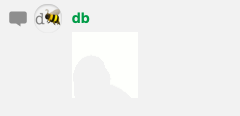

Somebody else took the idea one step further and made a `:transparent:` emoji
that was just a 64x64 transparent image. Take that, emoji police.

With that last step, a new possibility opened up: you could make a message that
was pure emoji, but where each emoji stood not as its own image-word, but as a
pixel in a grid of fixed-width emoji.

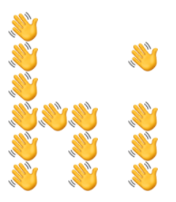

That greeting could be created from this message:

    :wave::transparent::transparent::transparent:
    :wave::transparent::transparent::transparent::wave:
    :wave::transparent::transparent::transparent::transparent:
    :wave::wave::wave::transparent::wave:
    :wave::transparent::wave::transparent::wave:
    :wave::transparent::wave::transparent::wave:
    :transparent::transparent::transparent::transparent::transparent:
    :transparent::transparent::transparent::transparent::transparent:

But no one's going to do that by hand.

I wrote [a ruby
script](https://github.com/danbernier/emoji-banner/blob/0e1cc6c66c628eacc443b0874a6db475fcbb2090/play.rb)
to do this. The code is a blunt object, a kludge: look around, but mind your
step. Running it is easy though -- here's the command I produced that example
with:

    dan@tower-of-babylon emoji-banner % ruby play.rb hi wave

The first argument, "hi", is the message (it can be wrapped in quotes if the
message contains spaces), and the emoji to render it in is the last argument.

The "font" was contributed by Tara Lynn Connelly, and I made some tweaks.
Each glyph can be 7 "pixels" high, and is specified semi-visually, as an array
of 7 ruby strings of any width (though all strings for each glyph must be of
equal length); the renderer adds its own spacing and kerns the result. Here's
the code for "i" and "j":

    'i' => [
      'o',
      ' ',
      'o',
      'o',
      'o',
      ' ',
      ' '
    ],   
    
    'j' => [
      '  o',
      '   ',
      '  o',
      '  o',
      '  o',
      'o o',
      'ooo'
    ],  

It (currently) supports the ability to use a different emoji for different
letters, which is only useful for exploring your tolerance for the garish.

# Gallery

Even with a smaller emoji and a full-width message window, the banner's text is
constrained, and in the earliest experiments, the banner's message was
reinforced by the emoji.

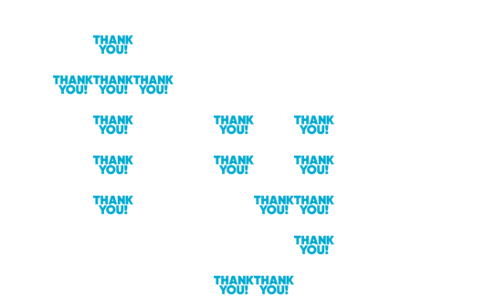

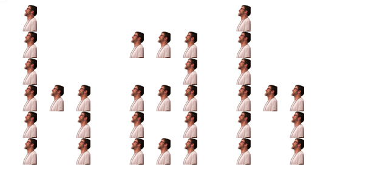

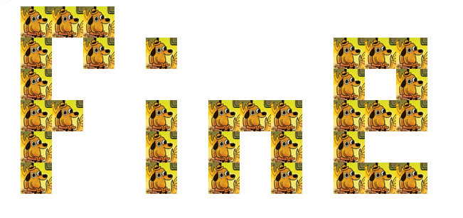

But the two layers can diverge, carrying messages that inform and complement
each other.

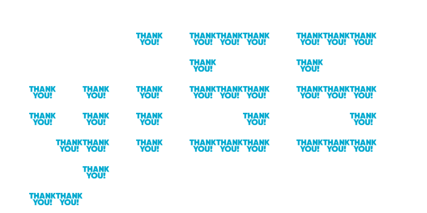

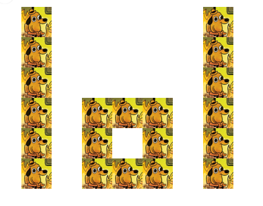

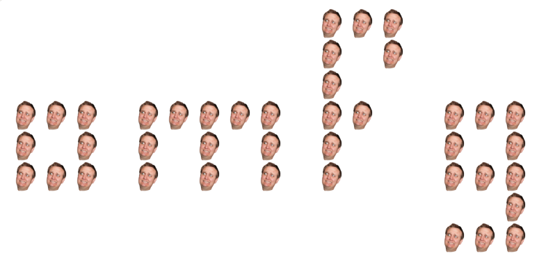

They can even carry different, contrasting messages.

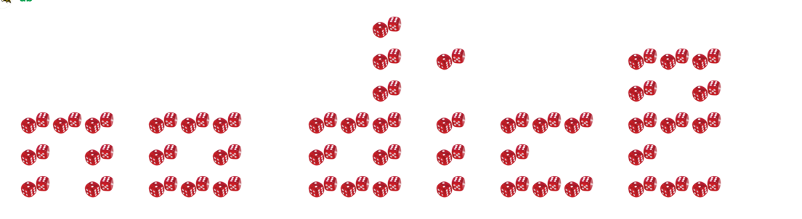

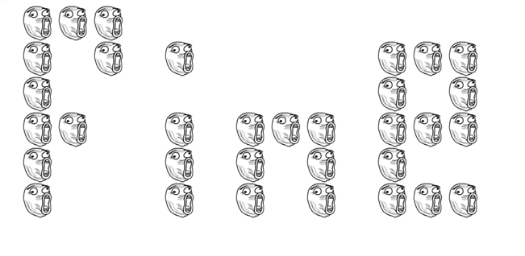

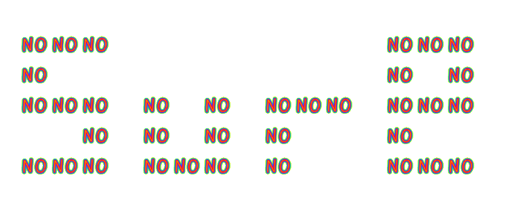

As you might expect from a tool for creating message banners of emoji, a tool
built for spectacle and volume, subtlety was a less common result.

Here's how Tara and I reminded the team to...well.

The emoji were both animated, cycling through a rainbow of colors, so this
captures only a fraction of the effect. (There was an undercurrent of anarchy
and the ridiculous in the team's culture that was wonderful for morale.)

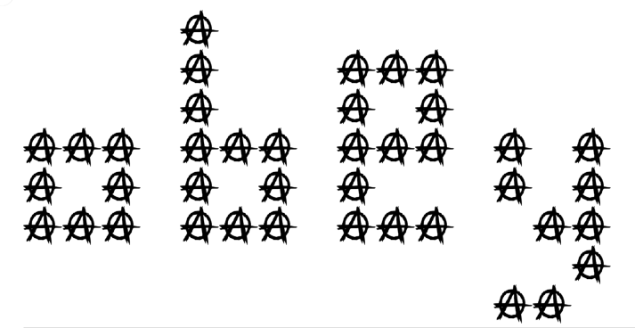

FIXME recreate some of these w/ find-replace.

# Bugs 🐞 🐝 🦟 🕷 🐛 🐜

There were two difficulties with using the script in flowdock. 

The first was a bug with how flowdock renders native emoji: they won't all
appear at the same size. Here, the message "luv" in ❤️ comes out lumpy and
illegible:

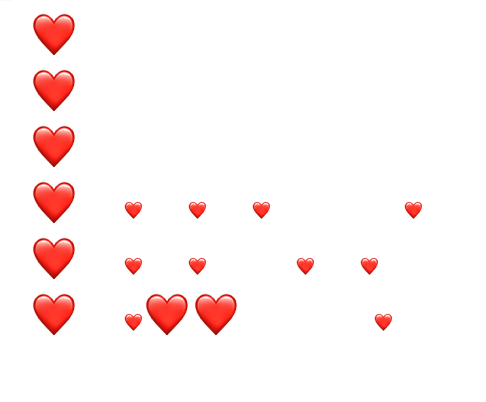

The second was flowdock's "inbox" feature, which narrows the area for viewing a
message, causing it to wrap incorrectly, making the banner message illegible.
Ironically, this was even worse when viewing the emoji at a large setting.
FIXME reword that last sentence. 

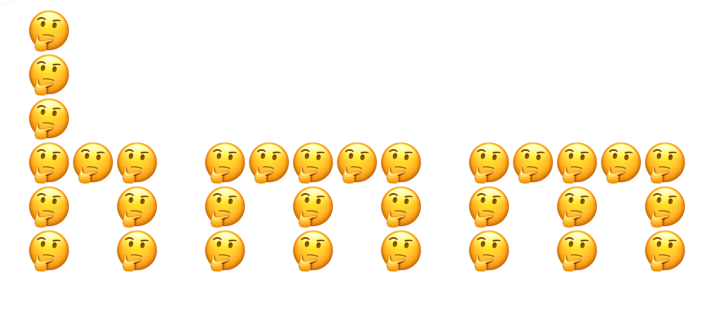

# Forward

I'd like to port this to javascript and have a tool here so anyone can blast
noise into their professional chat, and pair it with simple instructions for
adding a `:transparent:` emoji to your Slack. (It doesn't matter which chat
platform you use; this script will work with it if it supports custom emoji
with the `:emoji-name:` colon syntax.)

The "font" lacks characters. Punctuation and numbers could add expressiveness
to the messages. I'd like to make it easier to prepare a new font, add new
glyphs, and even change fonts on the fly.
